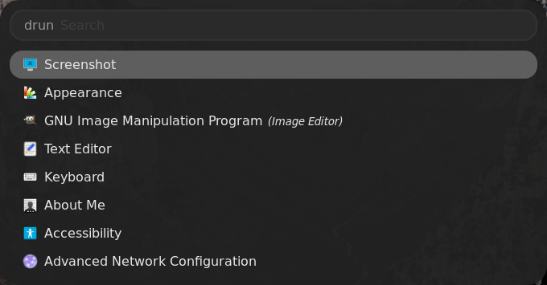
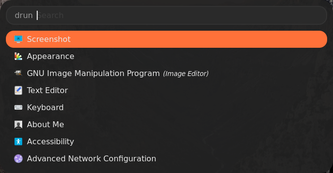

# Themes for the Rofi Launcher
Thanks to the awesome [@newmanls](https://github.com/newmanls/rofi-themes-collection) for providing the initial repo.

## What is Rofi?

Rofi is a window switcher, application launcher, and command executor for Linux systems. It provides a fast and convenient way to switch between open windows, launch applications, and run commands without using the mouse. Rofi is highly customizable and can be configured to match the user's preferences in terms of appearance, behavior, and functionality. It supports various modes of operation, such as the window switcher mode, the application launcher mode, the SSH mode, and the script executor mode. Rofi is widely used in Linux desktop environments and window managers as a replacement for other tools like dmenu or Alt+Tab. It is open source and actively developed by a community of contributors, making it a reliable and flexible tool for Linux users. You can learn more about Rofi [here](https://github.com/davatorium/rofi)

## How to Install Rofi

- On Debian / Ubuntu : `apt-get install rofi`
- On Arch / Arch-based : `pacman -S rofi`
- On Fedora : `dnf install rofi`

## Installing themes

1. Clone this repository and change to its directory:
```
$ git clone https://github.com/tiagomiguelcs/rofi-themes-collection.git
$ cd rofi-themes-collection
```

2. If you don't have the directories needed for the install create them with:
```
$ mkdir -p ~/.local/share/rofi/themes/
```

3. Copy your desired theme to `~/.local/share/rofi/themes` folder:
```
$ cp themes/<your-selected-theme> ~/.local/share/rofi/themes/
```

4. Run Rofi in `run` modi, then run `rofi-theme-selector`.

5. Search for your desired theme, press `enter` to preview, then `Alt+a` to accept the new theme.

6. Enjoy!

## Screenshots

### Rounded




